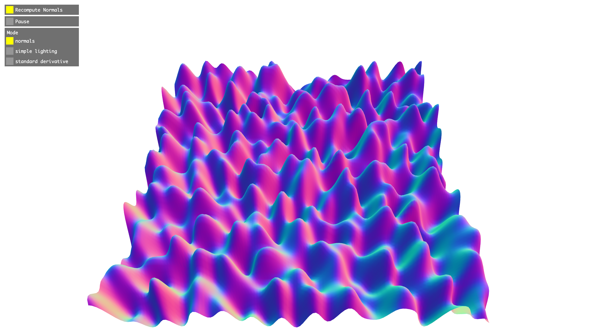

# geom-normals

Compute normals for a simplicial complex geometry based on faces/cells information.



## Installation

```bash
npm install geom-normals
```

## Usage

```js
import normals from "geom-normals";
import { plane } from "primitive-geometry";

const geometry = plane();

// Modify geometry.positions
// ...

// Recompute normals
normals(geometry.positions, geometry.cells, geometry.normals);
```

## API

#### `normals(positions, cells, [out]): normals`

**Parameters**

- positions: `TypedArray | Array | Array<[x, y, z]>` – simplicial complex geometry positions (eg. `new Float32Array([x, y, z, x, y, z, ...])/new Array(x, y, z, x, y, z, ...)` or `new Array([x, y, z], [x, y, z], ...)`)
- cells: `TypedArray | Array | Array<[x, y, z]>` – simplicial complex geometry cells (eg. `new Uint32Array([a, b, c, a, b, c, ...])/new Array(a, b, c, a, b, c, ...)` or `new Array([a, b, c], [a, b, c], ...)`)
- out (optional): `TypedArray | Array | Array<[x, y, z]>` – simplicial complex geometry normals to write to (eg. `new Float32Array([x, y, z, x, y, z, ...])/new Array(x, y, z, x, y, z, ...)` or `new Array([x, y, z], [x, y, z], ...)`)

**Returns**

- normals: `TypedArray | Array | Array<[x, y, z]>` – The normals parameter array updated (or created) with per vertex computed normals.

_Note: If there are two vertices with the same position but different index there will be discontinuity (hard edge)_

## License

MIT. See [license file](https://github.com/vorg/geom-normals/blob/master/LICENSE.md).
